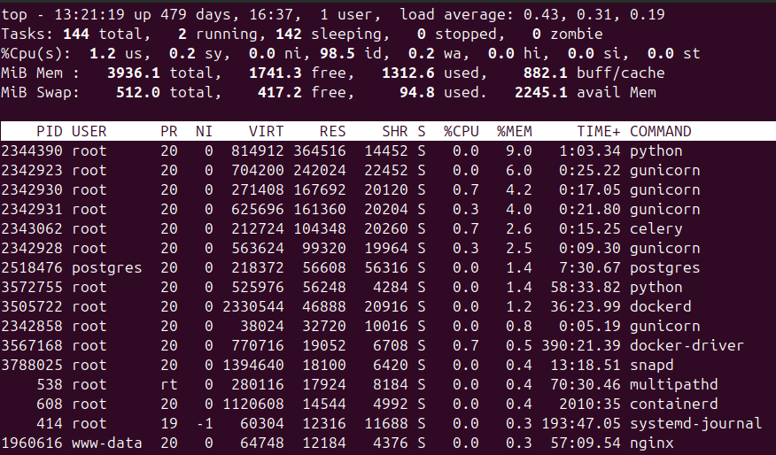

## Профайлинг

Под профайлингом понимаем измерение производительности разных компонентов приложения. Традиционно профайлинг для Питона делали через cProfile. Например, так.

Через контекст менеджер
```Python
import cProfile, pstats

with cProfile.Profile() as pr:
	make_stuff()

with open('profiling_output.txt', 'w') as stream:
	stats = pstats.Stats(pr, stream=stream).strip_dirs().sort_stats('tottime')
	stats.print_stats(7) # ограничимся 7ю строками
	stats = pstats.Stats(pr, stream=stream).sort_stats('tottime')
	stats.print_stats()
```

Или через декоратор
```Python
from typing import Callable
import cProfile, pstats

def profile_it(filename: str) -> Callable:

	def wrapper(func: Callable) -> Callable:

		def wrapped(*args, **kwargs):
			with cProfile.Profile() as pr:
				result = func(*args, **kwargs)
			with open(filename, 'w') as stream:
				stats = pstats.Stats(pr, stream=stream
					).strip_dirs(
					).sort_stats('tottime')
				stats.print_stats(7) # ограничимся 7ю строками
				stats = pstats.Stats(pr, stream=stream
					).sort_stats('tottime')
				stats.print_stats()
			return result
			
		return wrapped
	return wrapper

@profile_it("profiling_output.txt")
def make_stuff()
	...

make_stuff()

```

Результат работы
```Python
         897899 function calls (884602 primitive calls) in 1.385 seconds

   Ordered by: internal time
   List reduced from 609 to 7 due to restriction <7>

   ncalls  tottime  percall  cumtime  percall filename:lineno(function)
      435    0.243    0.001    0.385    0.001 .../psycopg/connection.py:386(wait)
      878    0.060    0.000    0.116    0.000 .../psycopg/_cursor_base.py:265(_maybe_prepare_gen)
      435    0.037    0.000    0.037    0.000 .../psycopg/client_cursor.py:48(_execute_send)
    20025    0.024    0.000    0.038    0.000 .../django/db/compiler.py:519(quote_name_unless_alias)
      435    0.023    0.000    0.155    0.000 .../django/db/compiler.py:229(get_select)
      787    0.021    0.000    0.200    0.000 .../django/db/compiler.py:316(_order_by_pairs)
61057/60594    0.019    0.000    0.035    0.000 {built-in method builtins.getattr}
```
ncalls - число вызовов функции
tottime - полное время, проведенное за выполнением функции
cumtime - полное время, проведенное за выполнением функции + всеми вызовами других функций из нее.

Из этого примера видно, что самая тяжелая часть ворклоада - это выполнение SQL запроса (что ожидаемо), а на втором месте - его формирование (что куда менее очевидно).

Может быть удобным визуализация результатов через https://github.com/jiffyclub/snakeviz  
Если вы датасатанист и пишете длинные тяжелые функции, вам может понадобиться профайлинг на уровне строк https://github.com/pyutils/line_profiler


**Ограничения**

cProfile видит только то, что выполняется в том же потоке, если требуется посмотреть код, который выполняется в другом - нужно дополнительно ставить там контекст/декоратор.

cProfile не показывает потребление памяти. Для него потребуется запускать отдельный профайлер наподобие https://github.com/pythonprofilers/memory_profiler 


**Асинхронный код**

Для приложений, в которых тяжелые места / боттлнеки могут быть именно во время выполнения асинхронного кода, работать с помощью cProfile может быть непросто или даже невозможно: в списке долгих вызовов мы можем запросто там увидеть только внутренности asyncio. Связано это с тем, что приостановка корутины (suspend) для него выглядит как выход из нее (call exit). В результате работа выполняется не там, где нам показывает профайлер.
Поэтому встречается мнение, что для профайлинга асинхронных приложений cProfile не подходит вообще. На мой взгляд, это зависит от приложения, и от того, как собственно написан код. Узкое место внутри корутины будет тогда, когда тяжелая / потенциально тяжелая работа не выделена в отдельную функцию.

Впрочем, вот эти два инструмента
https://github.com/sumerc/yappi
https://github.com/joerick/pyinstrument
заявляют точное профилирование асинхронного кода как фичу.


**Альтернатива**

Также yappi и pyinstrument заявляют о себе как об профайлерах нового поколения, но, на мой взгляд, несколько до этого не дотягивают. А что дотягивает? 

1. https://github.com/benfred/py-spy

Все мы знаем линуксовую утилиту top, которая позволяет посмотреть потребление памяти/CPU для процессов:



Py-spy позволяет, зная pid питоновского процесса, подцепиться к нему и посмотреть в реальном времени аналогичную картину для вызовов функций:


То есть мы можем без всякого дополнительного когда подключиться к работающим процессам (хоть в проде!) и посмотреть в реальном времени, что создает какие нагрузки. Это позволяет посмотреть на работу приложения совсем с другой стороны, в дополнение к традиционным профайлерам.
У py-spy есть много других фич, вроде просмотра стека вызовов для каждого треда, flame-диаграммы, но вот этого top достаточно, чтобы его использовать.


2. https://github.com/plasma-umass/scalene

Вот этот инструмент настолько хорош и современен, что заменит собой традиционные профайлеры:
- отдельно замеряет выполнение питоновского кода, нативного и системных вызовов (киллер фича)
- замеряет производительность GPU (еще одна киллер фича, пока только для Nvidia)
- подробно замеряет использование памяти (вплоть до объёмов скопированных данных!)

Сравнение:


Scalene talk (PyCon US 2021)
https://www.youtube.com/watch?v=5iEf-_7mM1k


**Итог**  
Вывод - обязательно попробуйте py-spy и scalene.
